# Обозначения

- Цветовые прямоугольники
  - Зеленый - лучший вариант с идеальными стыковками
  - Желтый - вариант имеет недостатки, но тоже хорошо стыкуется
- Линии
  - Толстая - приоритетный рейс
  - Штрих - неприоритетный/нерегулярный/неудобный рейс
- Подписи - вариант остаться на ночь

# Категоризация

| Диапазон  | Категория                                                                      | Тип  | Вагоны                                |
| --------- | ------------------------------------------------------------------------------ | ---- | ------------------------------------- |
| 1–698     | Пассажирские                                                                   | ПДС  | Купе/Плацкарт                         |
| 124       | Единственный пассажирский рейс проходящий на отрезке Абакан-Красноярск         | ПДС  | Купе/Плацкарт                         |
| 362,376   | Пассажирские, использующие вагоны в составе с сидячими местами вместо плацкарт | ПДС  | Сидячие места, Купе/Плацкарт          |
| 701-750   | Скоростные "Ласточки"                                                          | МВПС | Сидячие места                         |
| 751-788   | Высокоскоростные "Сапсаны"                                                     | МВПС | Сидячие места                         |
| 801–898   | Скорые, обслуживаемые МВПС                                                     | МВПС | Сидячие места повышенной комфортности |
| 6001–6998 | Пригородные                                                                    | МВПС | Сидячие места                         |
| 7001–7598 | Скорые пригородные                                                             | МВПС | Сидячие места                         |

- ПДС (поезд дальнего следования) на локомотивной тяге - классический поезд, весь состав тащит отдельный головной локомотив
- МВПС (моторвагонный подвижной состав) - классические электрички, часть состава является тяговыми вагонами, головной вагон только управляющий

# Рейсы

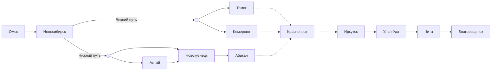

## Омск - Новосибирск

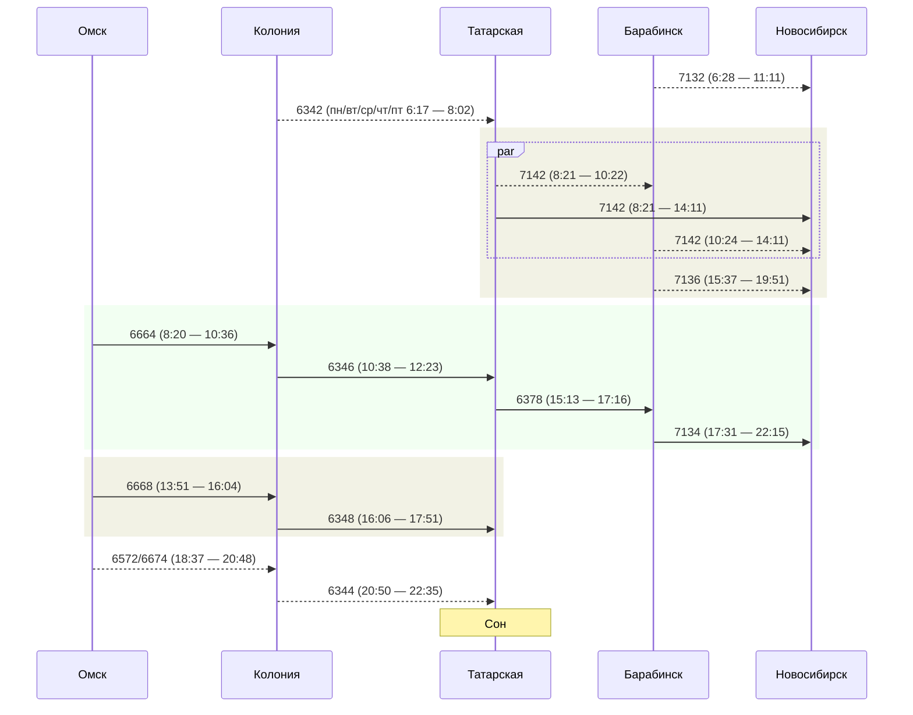

## Новосибирск - Красноярск

### Верхний путь

#### Новосибирск - Томск

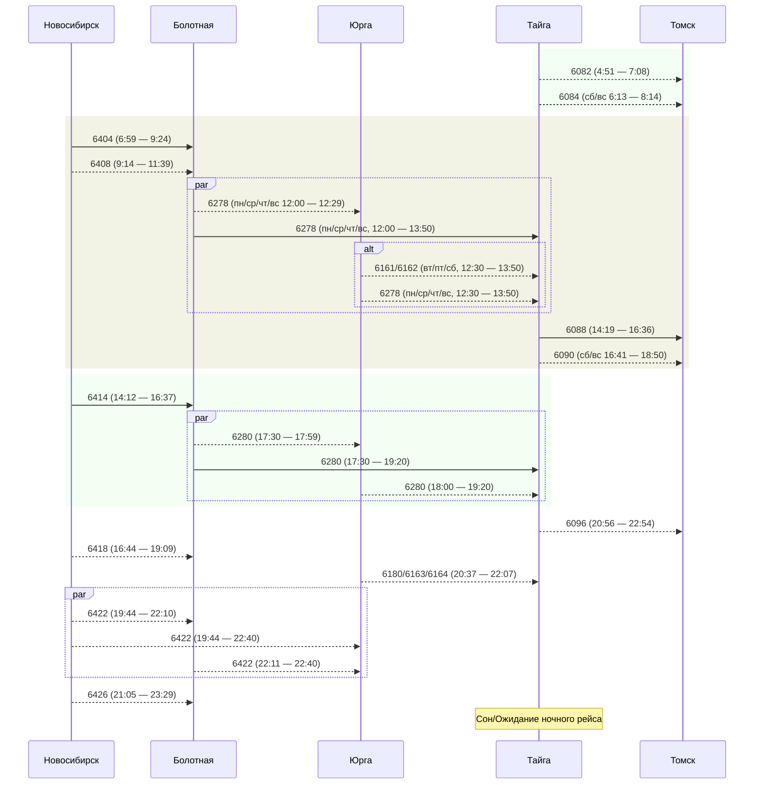

#### Новосибирск - Кемерово

- Выезд из Новосибирска только в пн/чт/пт

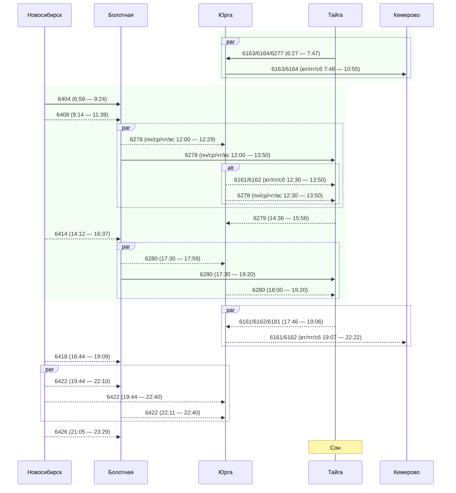

#### Томск/Кемерово - Красноярск

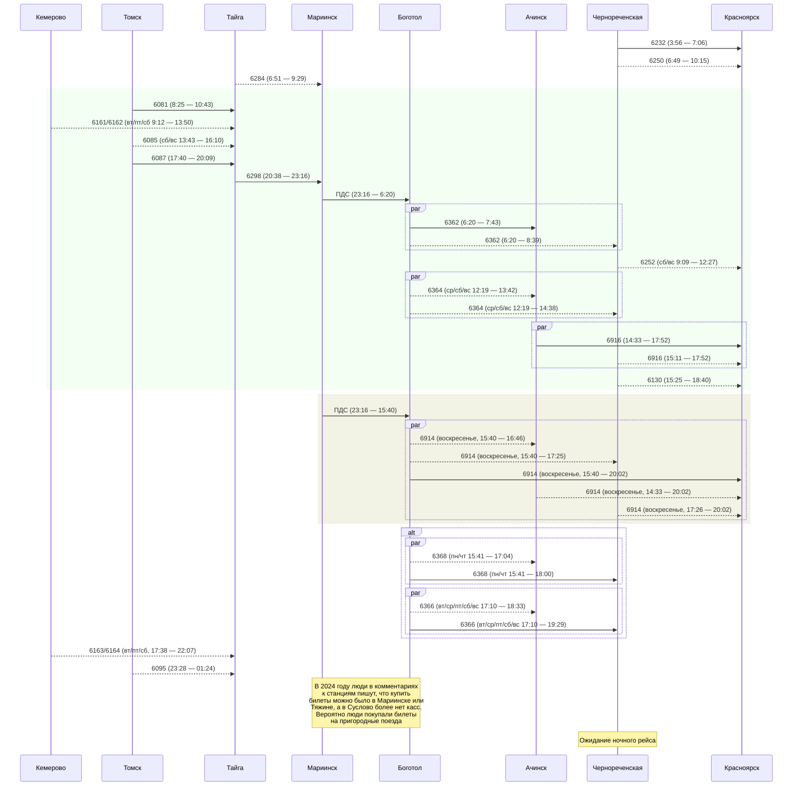

### Нижний путь

#### Новосибирск - Новокузнецк

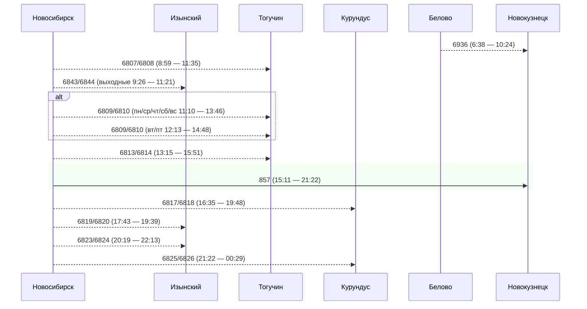

#### Новосибирск - Алтай

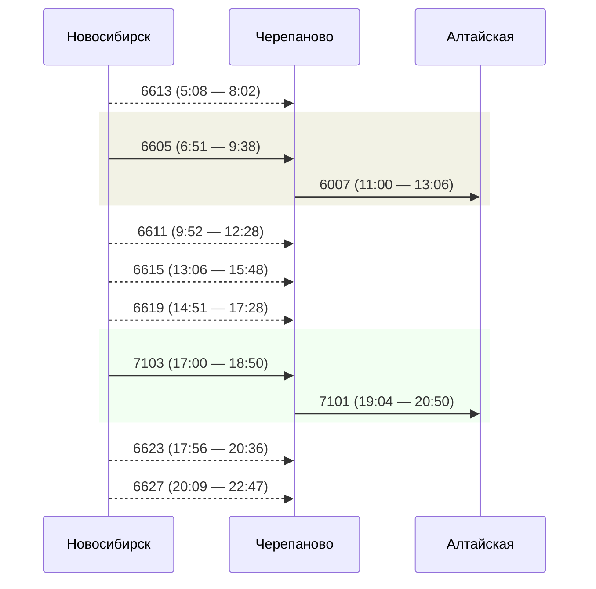

#### Алтай - Новокузнецк

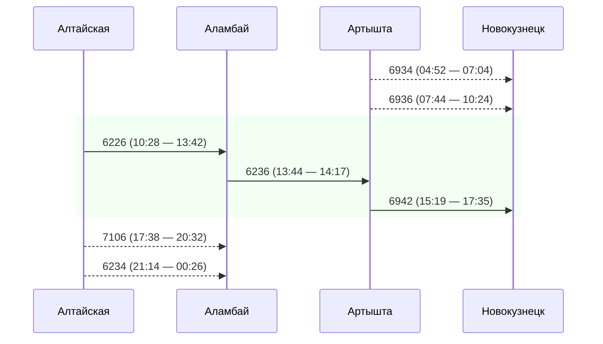

#### Новокузнецк - Абакан

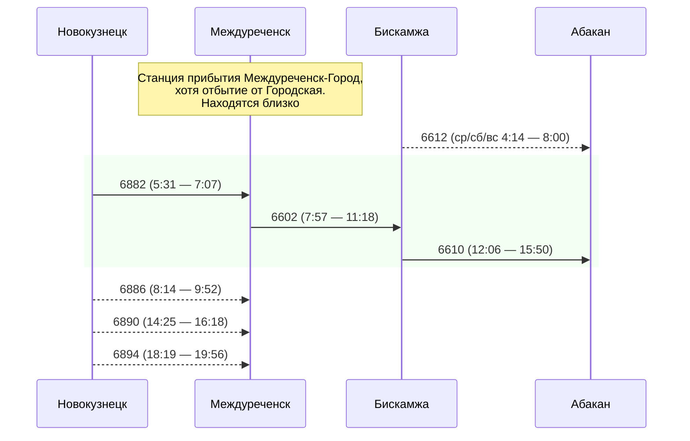

#### Абакан - Красноярск (Трасса мужества)

- 124 рейс - исключение из правил. Подробнее в секции "Категоризация"

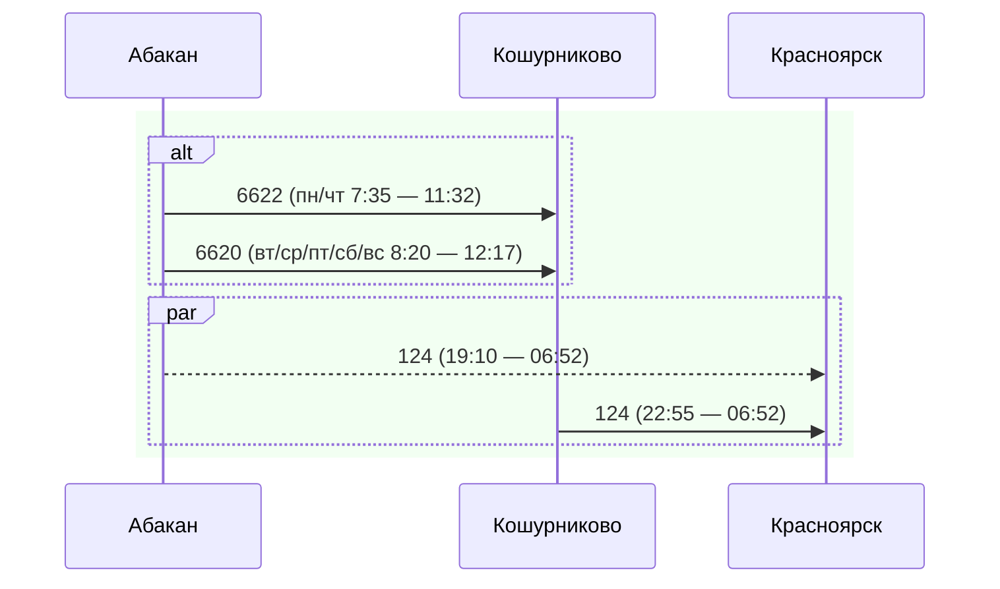

## Красноярск - Иркутск

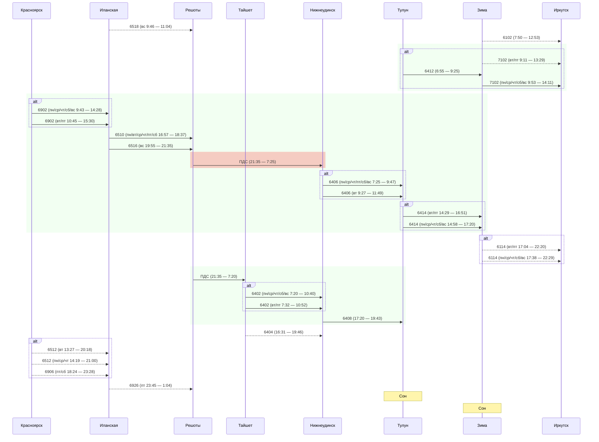

## Иркутск - Улан-Удэ

- 326 рейс - исключение из правил. Подробнее в секции "Категоризация"
- От вокзала Слюдянки идете пешком около 3 километров на запад вдоль берега в сторону Култука — прямо на Шаманский мыс. Это узкая песчано-галечная коса, уходящая в Байкал. Там дико, бесплатно, чисто и удобно ставить палатку.

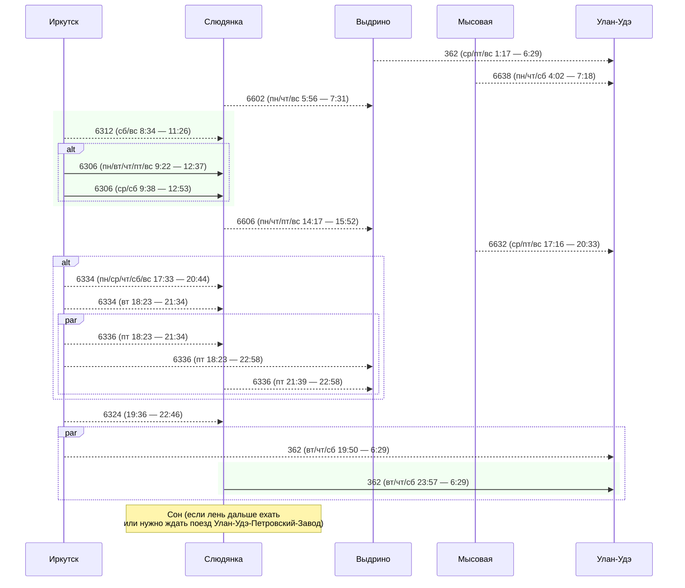

## Улан-Удэ - Чита

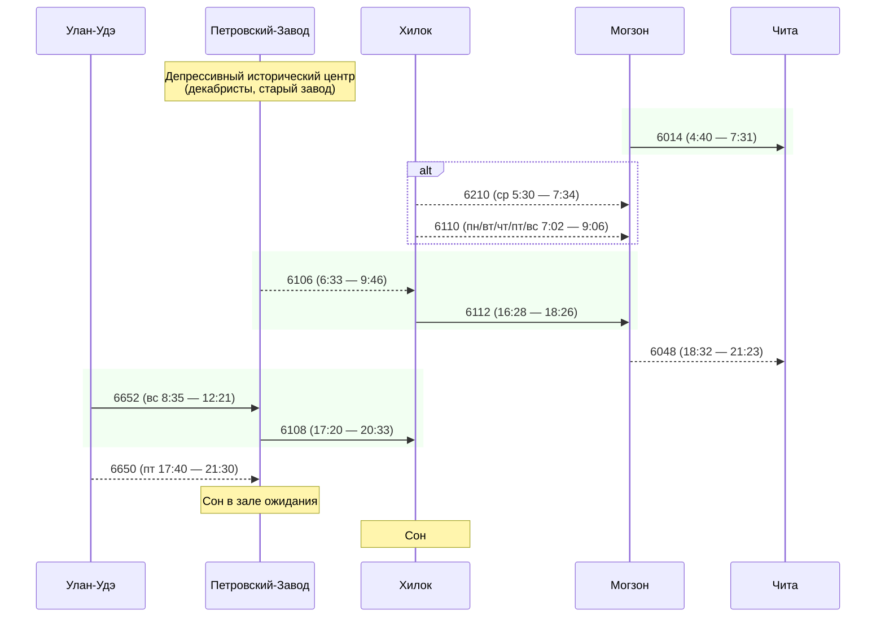

## Чита - Благовещенск

- 376 рейс - исключение из правил. Подробнее в секции "Категоризация"

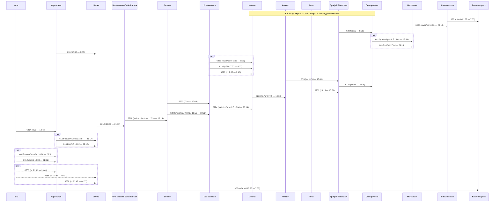
