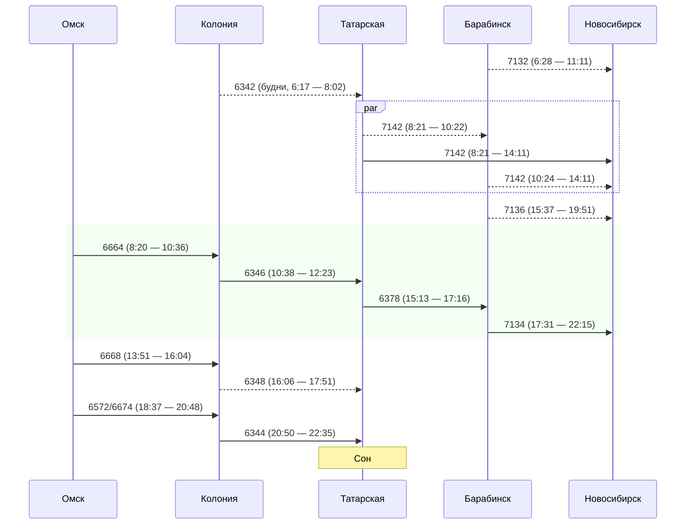
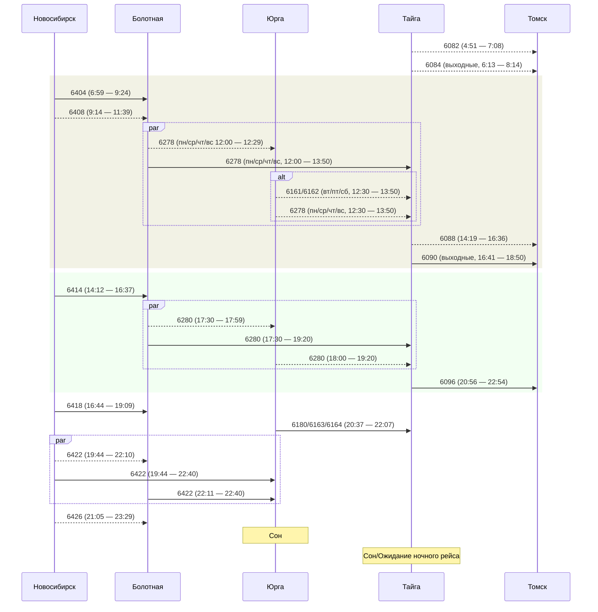
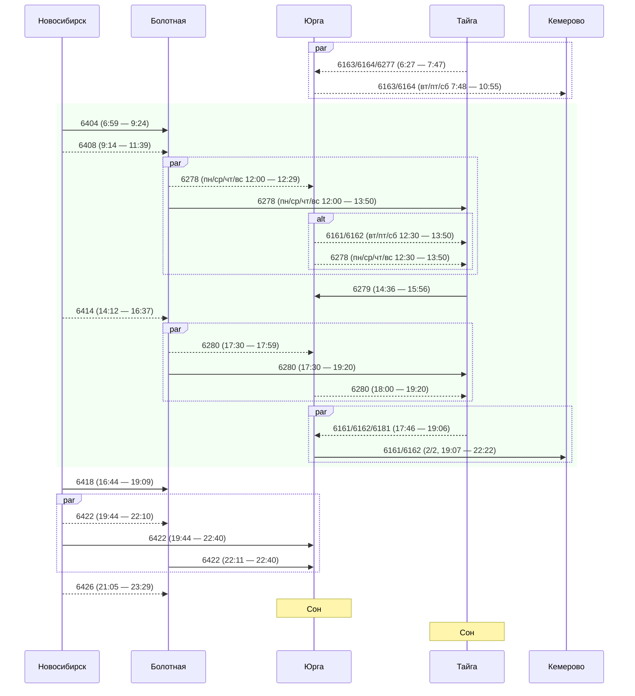
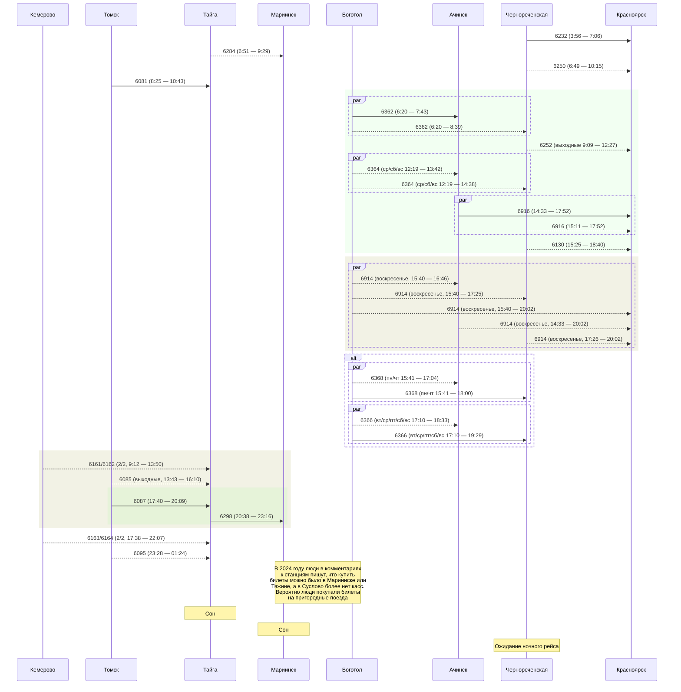
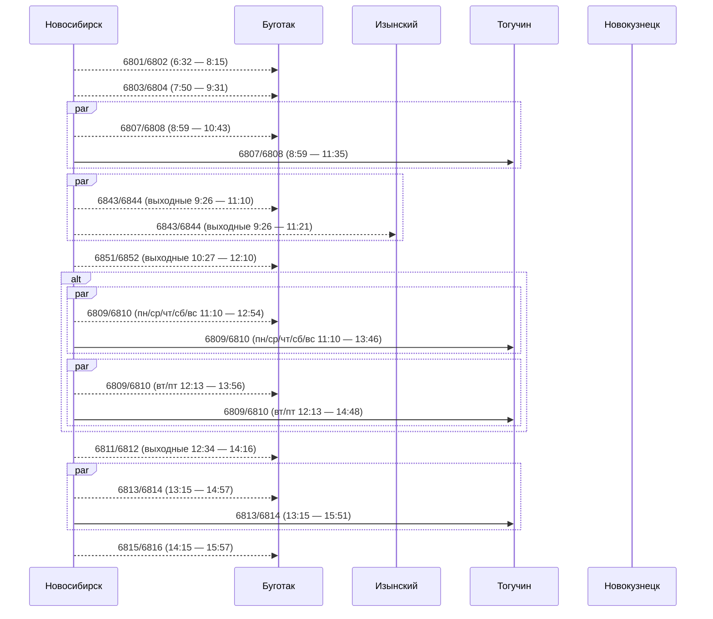

# Оформление

- Цветовые прямоугольники
  - Зеленый - лучший вариант с идеальными стыковками
  - Желтый - вариант имеет недостатки, но тоже хорошо стыкуется
- Линии
  - Толстая - приоритетный рейс
  - Штрих - неприоритетный/нерегулярный/неудобный рейс
- Подписи - вариант остаться на ночь

# Рейсы

## Омск

### Омск - Новосибирск

## Новосибирск

### Верхний путь

#### Новосибирск - Томск

#### Новосибирск - Кемерово

#### Томск/Кемерово - Красноярск

### Нижний путь

#### Новосибирск - Новокузнецк

