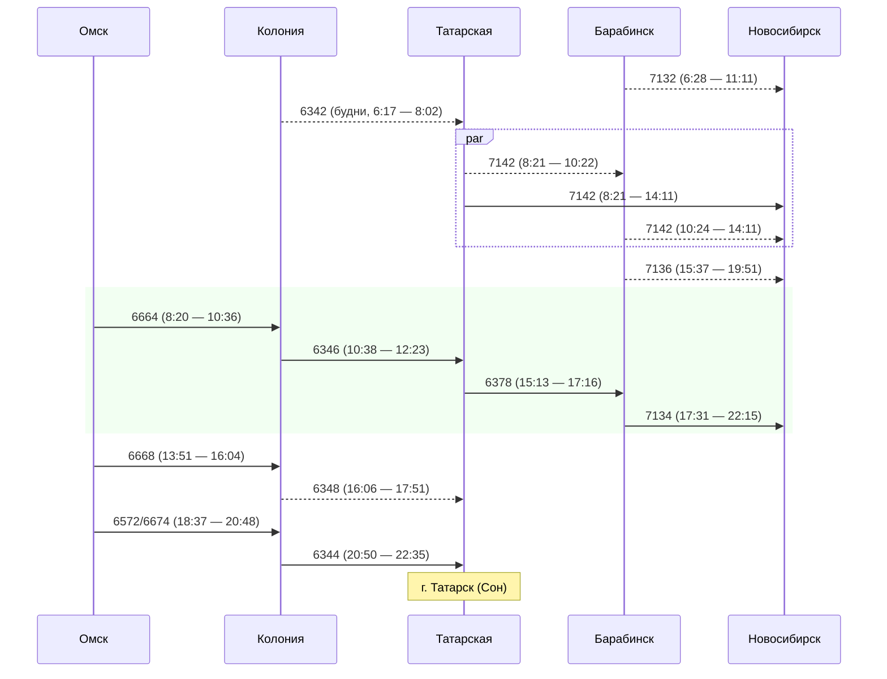
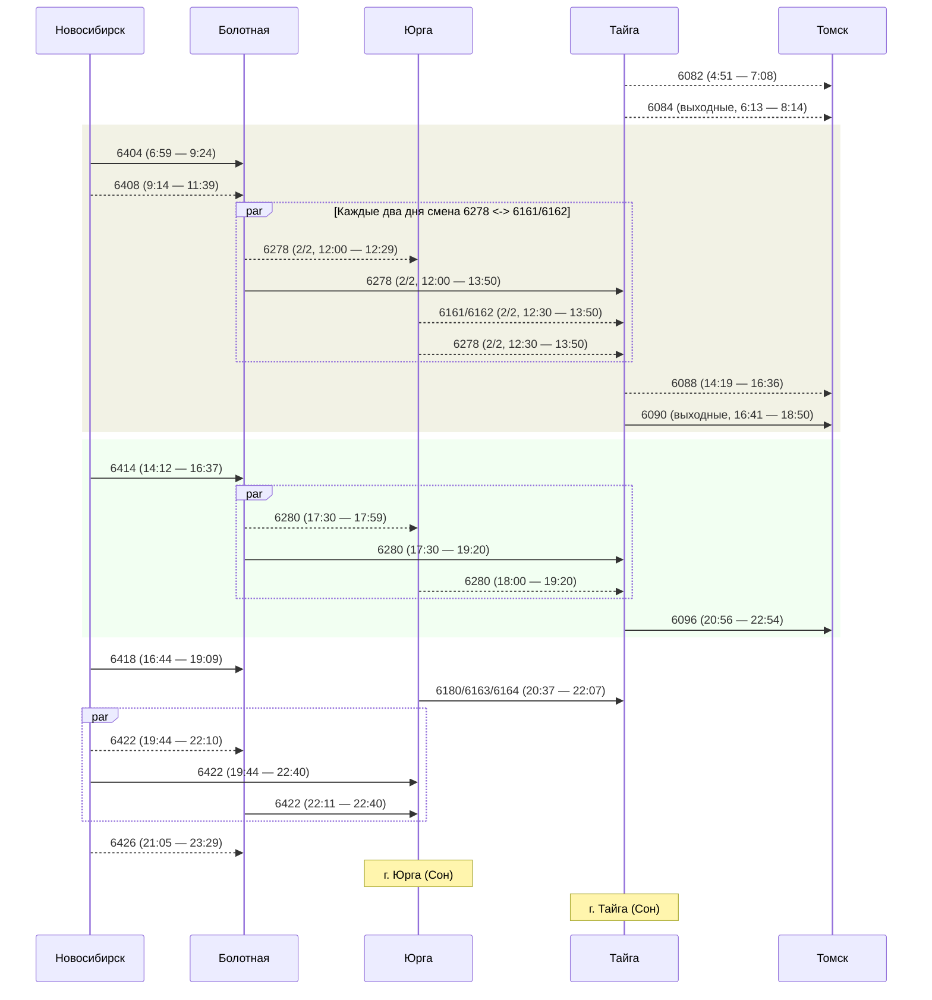
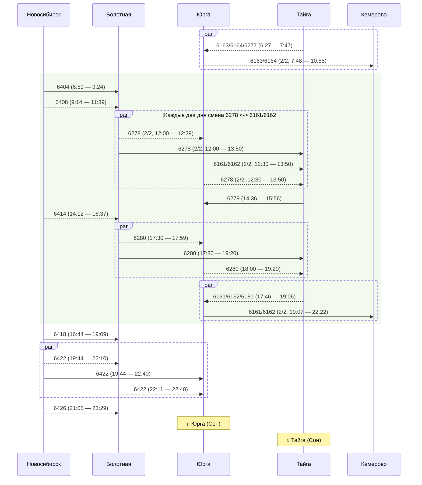

## Омск - Новосибирск

```mermaid
sequenceDiagram
    participant Омск
    participant Колония
    participant Татарская
    participant Барабинск
    participant Новосибирск

    Барабинск-->>Новосибирск: 7132 (6:28 — 11:11)

    Колония-->>Татарская: 6342 (будни, 6:17 — 8:02)
    par
    Татарская-->>Барабинск: 7142 (8:21 — 10:22)
    Татарская->>Новосибирск: 7142 (8:21 — 14:11)
    Барабинск-->>Новосибирск: 7142 (10:24 — 14:11)
    end
    Барабинск-->>Новосибирск: 7136 (15:37 — 19:51)

    rect rgba(0, 255, 0, 0.05)
    Омск->>Колония: 6664 (8:20 — 10:36)
    Колония->>Татарская: 6346 (10:38 — 12:23)
    Татарская->>Барабинск: 6378 (15:13 — 17:16)
    Барабинск->>Новосибирск: 7134 (17:31 — 22:15)
    end

    Омск->>Колония: 6668 (13:51 — 16:04)
    Колония-->>Татарская: 6348 (16:06 — 17:51)

    Омск->>Колония: 6572/6674 (18:37 — 20:48)
    Колония->>Татарская: 6344 (20:50 — 22:35)

    Note over Татарская: г. Татарск (Сон)
```

## Новосибирск - Томск

```mermaid
sequenceDiagram
    participant Новосибирск
    participant Болотная
    participant Юрга
    participant Тайга
    participant Томск

    Тайга-->>Томск: 6082 (4:51 — 7:08)

    Тайга-->>Томск: 6084 (выходные, 6:13 — 8:14)

    rect rgba(127, 127, 0, 0.1)
    Новосибирск->>Болотная: 6404 (6:59 — 9:24)
    Новосибирск-->>Болотная: 6408 (9:14 — 11:39)
    par Каждые два дня смена 6278 <-> 6161/6162
    Болотная-->>Юрга: 6278 (2/2, 12:00 — 12:29)
    Болотная->>Тайга: 6278 (2/2, 12:00 — 13:50)
    Юрга-->>Тайга: 6161/6162 (2/2, 12:30 — 13:50)
    Юрга-->>Тайга: 6278 (2/2, 12:30 — 13:50)
    end
    Тайга-->>Томск: 6088 (14:19 — 16:36)
    Тайга->>Томск: 6090 (выходные, 16:41 — 18:50)
    end

    rect rgba(0, 255, 0, 0.05)
    Новосибирск->>Болотная: 6414 (14:12 — 16:37)
    par
    Болотная-->>Юрга: 6280 (17:30 — 17:59)
    Болотная->>Тайга: 6280 (17:30 — 19:20)
    Юрга-->>Тайга: 6280 (18:00 — 19:20)
    end
    Тайга->>Томск: 6096 (20:56 — 22:54)
    end

    Новосибирск->>Болотная: 6418 (16:44 — 19:09)

    Юрга->>Тайга: 6180/6163/6164 (20:37 — 22:07)

    par
    Новосибирск-->>Болотная: 6422 (19:44 — 22:10)
    Новосибирск->>Юрга: 6422 (19:44 — 22:40)
    Болотная->>Юрга: 6422 (22:11 — 22:40)
    end

    Новосибирск-->>Болотная: 6426 (21:05 — 23:29)

    Note over Юрга: г. Юрга (Сон)
    Note over Тайга: г. Тайга (Сон)
```

## Новосибирск - Кемерово

```mermaid
sequenceDiagram
    participant Новосибирск
    participant Болотная
    participant Юрга
    participant Тайга
    participant Кемерово

    par
    Тайга-->>Юрга: 6163/6164/6277 (6:27 — 7:47)
    Юрга-->>Кемерово: 6163/6164 (2/2, 7:48 — 10:55)
    end

    rect rgba(75, 175, 0, 0.07)
    Новосибирск->>Болотная: 6404 (6:59 — 9:24)
    Новосибирск-->>Болотная: 6408 (9:14 — 11:39)
    par Каждые два дня смена 6278 <-> 6161/6162
    Болотная-->>Юрга: 6278 (2/2, 12:00 — 12:29)
    Болотная->>Тайга: 6278 (2/2, 12:00 — 13:50)
    Юрга-->>Тайга: 6161/6162 (2/2, 12:30 — 13:50)
    Юрга-->>Тайга: 6278 (2/2, 12:30 — 13:50)
    end

    Тайга->>Юрга: 6279 (14:36 — 15:56)

    Новосибирск-->>Болотная: 6414 (14:12 — 16:37)
    par
    Болотная-->>Юрга: 6280 (17:30 — 17:59)
    Болотная->>Тайга: 6280 (17:30 — 19:20)
    Юрга-->>Тайга: 6280 (18:00 — 19:20)
    end
    par
    Тайга-->>Юрга: 6161/6162/6181 (17:46 — 19:06)
    Юрга->>Кемерово: 6161/6162 (2/2, 19:07 — 22:22)
    end
    end

    Новосибирск->>Болотная: 6418 (16:44 — 19:09)

    par
    Новосибирск-->>Болотная: 6422 (19:44 — 22:10)
    Новосибирск->>Юрга: 6422 (19:44 — 22:40)
    Болотная->>Юрга: 6422 (22:11 — 22:40)
    end

    Новосибирск-->>Болотная: 6426 (21:05 — 23:29)

    Note over Юрга: г. Юрга (Сон)
    Note over Тайга: г. Тайга (Сон)
```
