# Оформление

- Цветовые прямоугольники
  - Зеленый - лучший вариант с идеальными стыковками
  - Желтый - вариант имеет недостатки, но тоже хорошо стыкуется
- Линии
  - Толстая - приоритетный рейс
  - Штрих - неприоритетный/нерегулярный/неудобный рейс
- Подписи - вариант остаться на ночь

# Рейсы

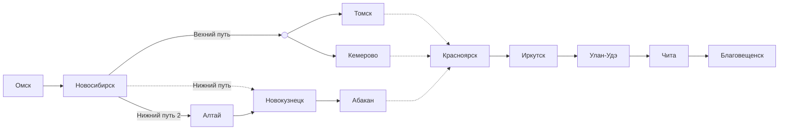

## Омск - Новосибирск

#### Омск - Новосибирск

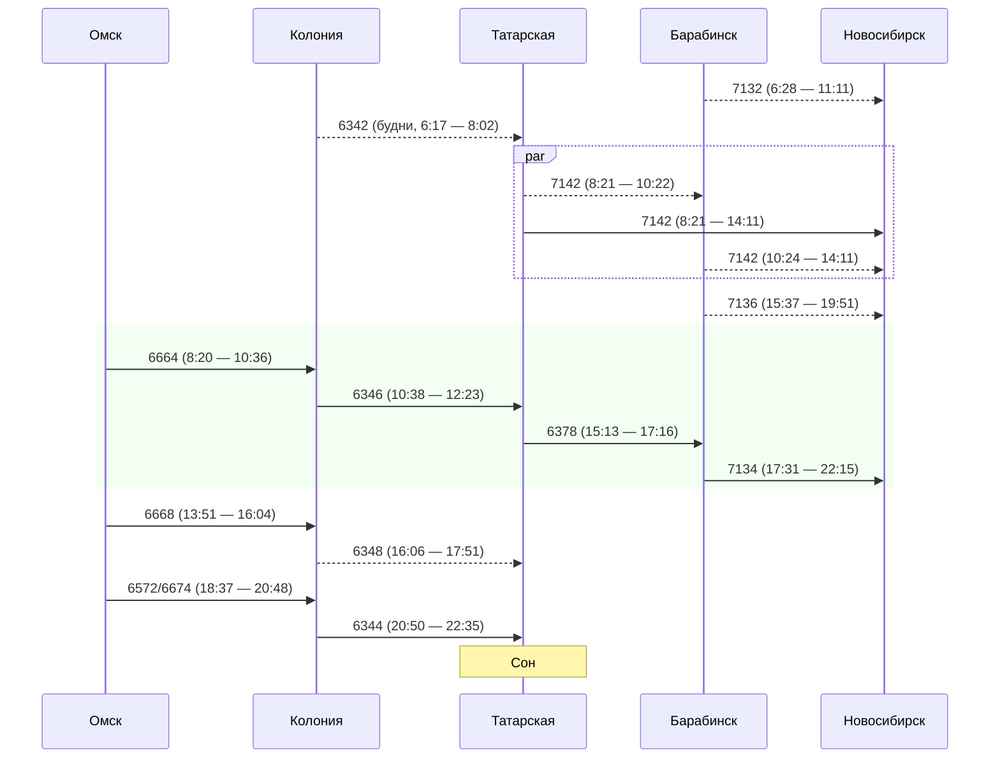

## Новосибирск - Красноярск

### Верхний путь

#### Новосибирск - Томск

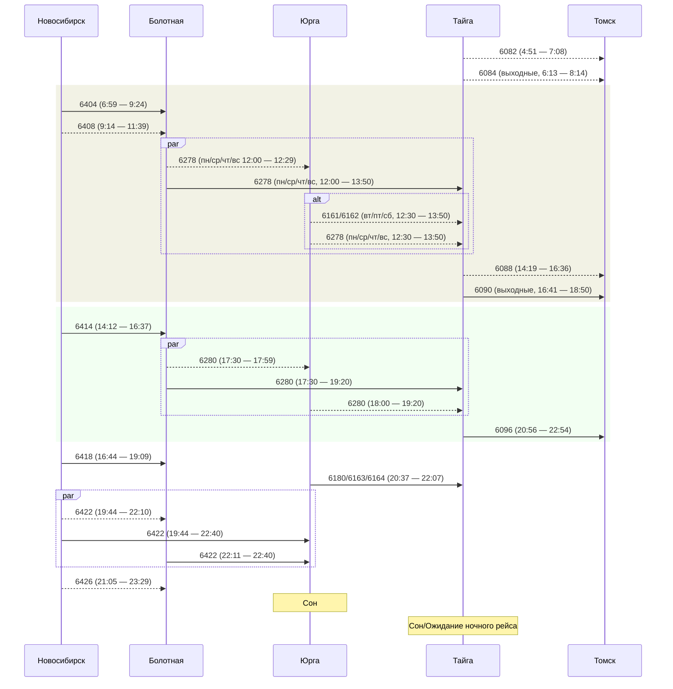

#### Новосибирск - Кемерово

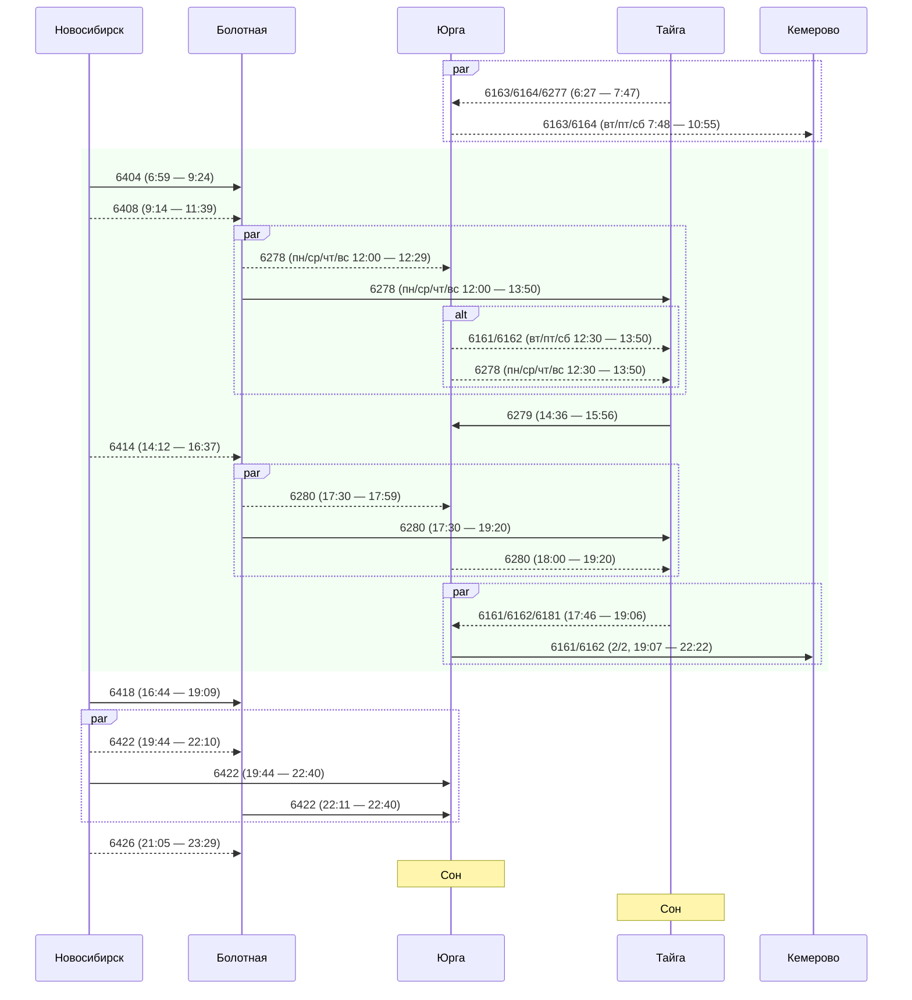

#### Томск/Кемерово - Красноярск (Не стыкуется)

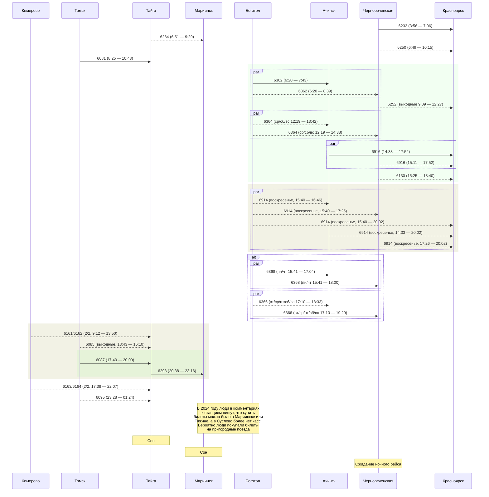

### Нижний путь (Не стыкуется, есть прямой)

#### Новосибирск - Новокузнецк

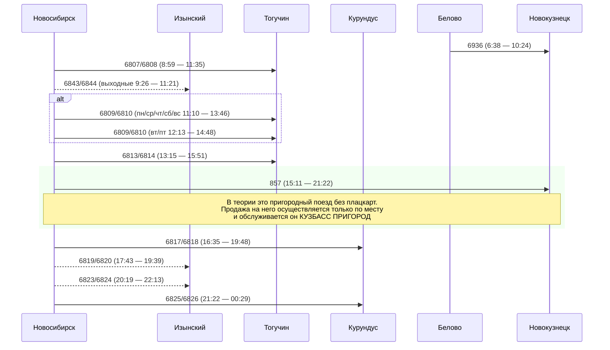

### Нижний путь 2 (Не стыкуется, есть прямой)

#### Новосибирск - Алтай

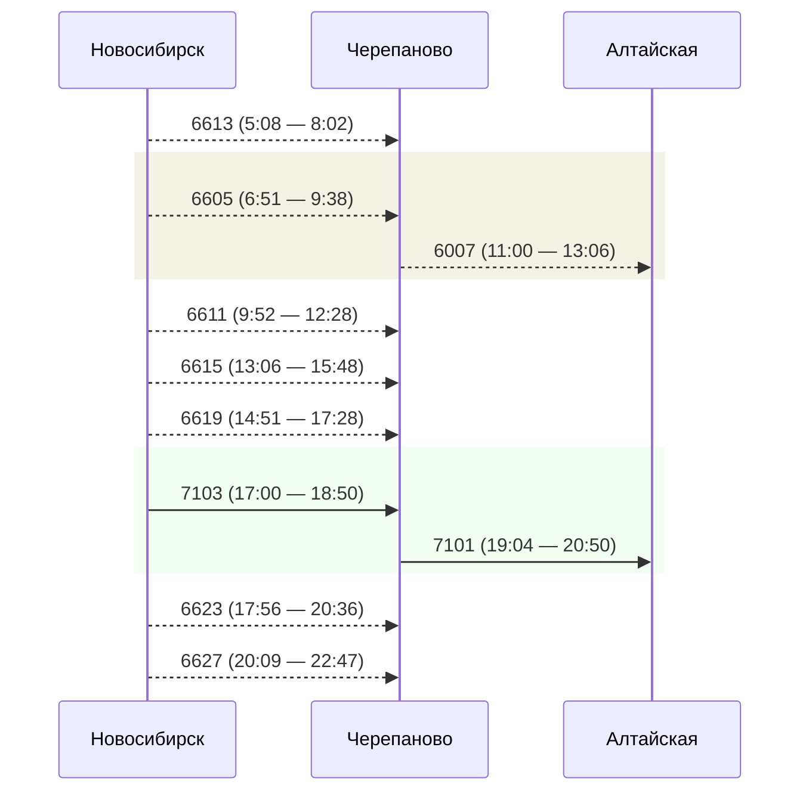

#### Алтай - Новокузнецк

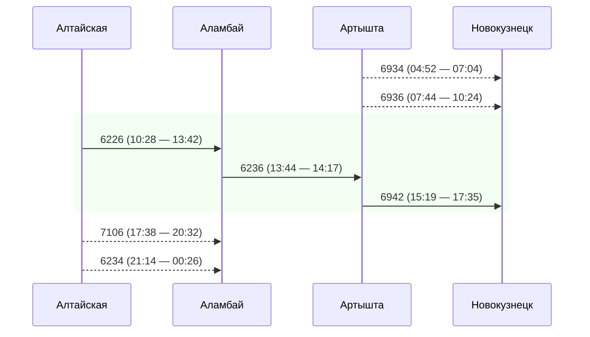

#### Новокузнецк - Абакан

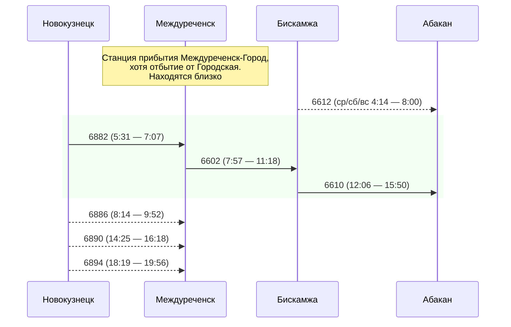

#### Абакан - Красноярск

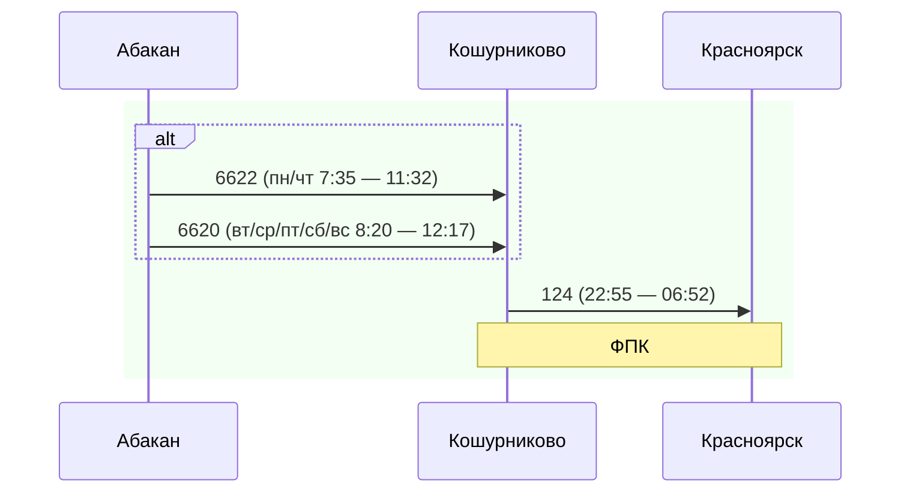

## Красноярск - Иркутск

#### Красноярск - Иркутск

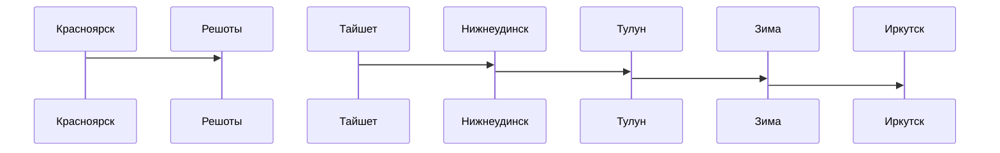

## Иркутск - Улан-Удэ

## Улан-Удэ - Чита

## Чита - Благовещенск
