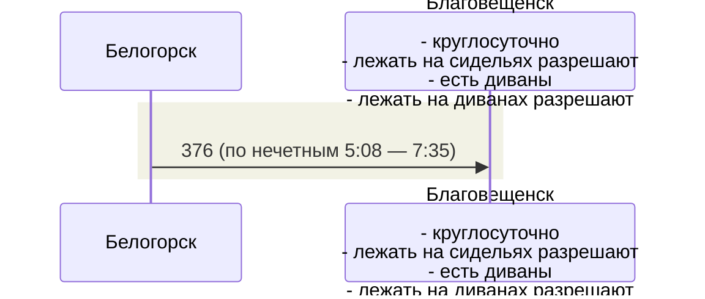
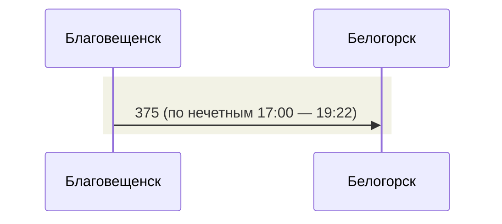

# Расписание

## Белогорск - Благовещенск

```mermaid
sequenceDiagram
    participant Белогорск
    participant Благовещенск as Благовещенск<br><br>- круглосуточно<br>- лежать на сидельях разрешают<br>- есть диваны<br>- лежать на диванах разрешают

    rect rgba(127, 127, 0, 0.1)
    Белогорск->>Благовещенск: 376 (по нечетным 5:08 — 7:35)
    end
```

## Благовещенск - Белогорск

```mermaid
sequenceDiagram
    participant Благовещенск
    participant Белогорск

    rect rgba(127, 127, 0, 0.1)
    Благовещенск->>Белогорск: 375 (по нечетным 17:00 — 19:22)
    end
```
