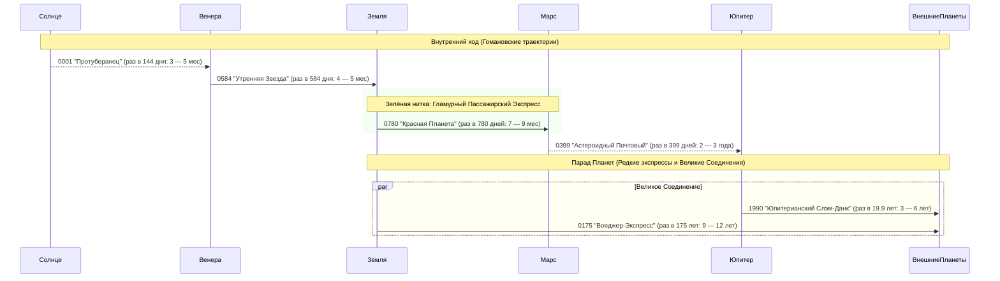

```mermaid
sequenceDiagram
    participant Солнце
    participant Венера
    participant Земля
    participant Марс
    participant Юпитер
    participant ВнешниеПланеты

    Note over Солнце,ВнешниеПланеты: Внутренний ход (Гомановские траектории)

    Солнце-->>Венера: 0001 "Протуберанец" (раз в 144 дня: 3 — 5 мес)
    Венера->>Земля: 0584 "Утренняя Звезда" (раз в 584 дня: 4 — 5 мес)

    rect rgba(0, 255, 0, 0.05)
    Note over Земля,Марс: Зелёная нитка: Гламурный Пассажирский Экспресс
    Земля->>Марс: 0780 "Красная Планета" (раз в 780 дней: 7 — 9 мес)
    end

    Марс-->>Юпитер: 0399 "Астероидный Почтовый" (раз в 399 дней: 2 — 3 года)

    Note over Земля,ВнешниеПланеты: Парад Планет (Редкие экспрессы и Великие Соединения)

    rect rgba(255, 255, 0, 0.05)
    par Великое Соединение
    Юпитер->>ВнешниеПланеты: 1990 "Юпитерианский Слэм-Данк" (раз в 19.9 лет: 3 — 6 лет)
    Земля->>ВнешниеПланеты: 0175 "Вояджер-Экспресс" (раз в 175 лет: 9 — 12 лет)
    end
    end
```
